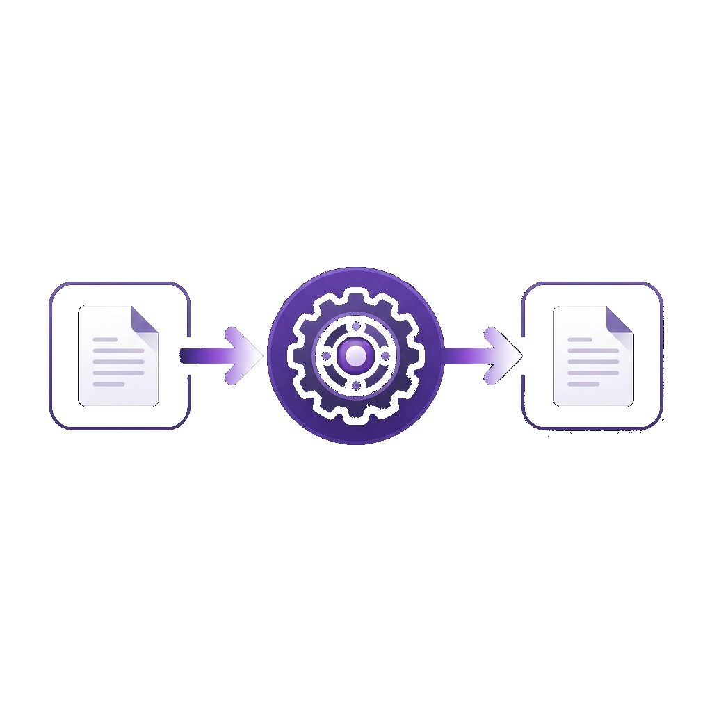

# Convertra


Convertra is a modern and flexible file conversion web application that provides seamless and quick conversions across various formats. Built with a Flask backend and a React (Vite) frontend, it features a sleek design with built-in dark mode support.

## Features

- **Format Conversion**: Convert files reliably and quickly between various output formats.
- **Sleek User Interface**: Playful, modern design that is easy to navigate, with an alternative dark mode theme.
- **Interactive Uploads**: Intuitive file upload interface handling user selections seamlessly.



## Architecture

Convertra operates on a decoupled architecture, ensuring clean separation of concerns and maintainability:
- **Frontend**: A fast React application powered by Vite, utilizing Lucide React for iconography.
- **Backend**: A robust Flask application handling RESTful API requests, powered by several Python data manipulation libraries including Pandas, PyMuPDF, and BeautifulSoup4.

## Prerequisites

Ensure you have the following installed on your system before proceeding:
- Python 3.10+
- Node.js (v18+)
- npm or yarn

## Installation and Development

The application is split into two main directories: `backend` and `frontend`. You will need to start both development servers concurrently to work on the application.

### 1. Setting up the Backend

Open your terminal, navigate to the backend directory, install the Python dependencies within a virtual environment, and start the Flask development server.

```bash
cd backend
python -m venv .venv

# On Windows use:
.venv\Scripts\activate
# On macOS/Linux use:
# source .venv/bin/activate

pip install -r requirements.txt
python run.py
```

By default, the backend server will run on port 5000 or the port specified in your configuration.

### 2. Setting up the Frontend

Open a new terminal window, navigate to the frontend directory, install the necessary Node modules, and start the Vite development server.

```bash
cd frontend
npm install
npm run dev
```

The Vite development server will start, typically running on `http://localhost:5173`. Access this URL in your web browser to interact with the application.

## Project Structure

- `frontend/`: The React (Vite) frontend containing all user interface and component code.
- `backend/`: The Flask API, managing file conversions, temp storage, and processing logic.
- `assets/`: Project documentation and illustration assets.

